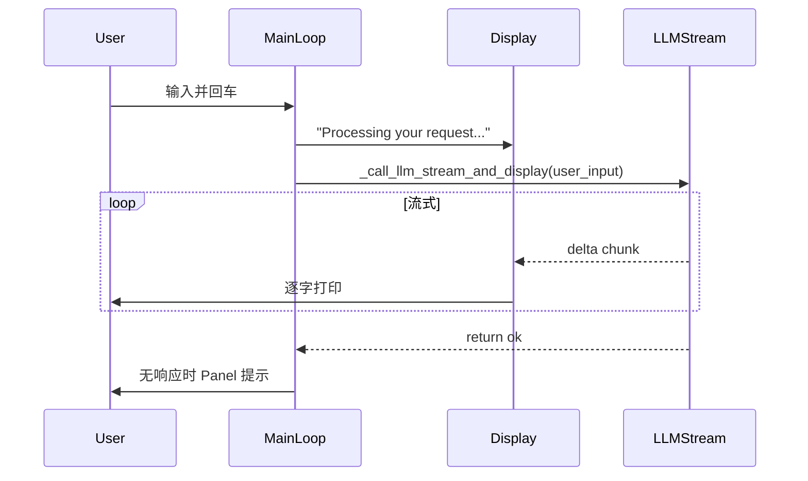

# 对话耗时统计与 TUI 展示方案

## 目标

- 统计**单次对话**的耗时：从用户输入提交到**流式输出结束**（最后一 chunk 显示完）。
- 在 TUI 上展示该耗时，并用**不同颜色**区分快/中/慢。

## 当前流程（简要）

耗时应覆盖：进入 `_call_llm_stream_and_display` 后、开始消费 `chat_stream` 之前 → 流式循环结束（含异常/中断）。

## 实现要点

### 1. 计时范围与实现位置

- **文件**：`[src/mini_coder/tui/console_app.py](src/mini_coder/tui/console_app.py)`
- **函数**：`_call_llm_stream_and_display`（约 405–456 行）
- **开始**：在 `_ensure_llm_service()` 通过后、`for event in self._llm_service.chat_stream(user_input):` 之前，调用 `time.perf_counter()` 记录 `t_start`。
- **结束**：在流式循环**正常结束**或 **break（如 loop_detected）** 或 **except** 时记录 `t_end`，用 `try/finally` 保证异常时也能计算耗时。
- **结果**：计算 `duration_sec = t_end - t_start`，并随返回值一起交给主循环用于展示。

### 2. 返回值扩展

- **当前**：`_call_llm_stream_and_display(self, user_input: str) -> bool`
- **建议**：改为返回 `Tuple[bool, Optional[float]]`：
  - 第一项：是否得到有效响应（原有 `not first` 逻辑不变）。
  - 第二项：本次对话耗时（秒），无计时时为 `None`（例如未进入流式就 return False）。
- 调用处（约 912 行）改为解包：`ok, duration_sec = self._call_llm_stream_and_display(user_input)`，并根据 `duration_sec is not None` 决定是否打印耗时行。

### 3. TUI 展示位置与格式

- **位置**：在流式输出**之后**、当前已有的 `self._console.print()` 之后；若存在“loop detected”等提示，放在这些提示**之后**再打印耗时，避免打断内容阅读。
- **格式建议**：单行、与正文区分，例如：
  - `本次对话耗时 3.25s` 或 `⏱ 3.25s`
- **颜色区分（按耗时）**：用 Rich 的 `[color]...[/color]`，与现有 `[dim]`、`[yellow]` 等风格一致：
  - **较快**（例如 < 5s）：`[green]`，表示体验良好。
  - **中等**（例如 5s ≤ t < 15s）：`[yellow]`，表示可接受。
  - **较慢**（例如 ≥ 15s）：`[red]` 或 `[bold red]`，表示明显偏慢。
- 阈值可写为模块级常量（如 `DURATION_FAST_S`, DURATION_SLOW_S`），便于后续调参或配置化。

### 4. 边界情况

- **无响应**（`ok is False`）：仍可显示耗时（例如“本次请求耗时 30.0s（未获得响应）”），便于区分超时与瞬间失败。
- **循环检测中断**：已有 `loop_detected` 分支，耗时照常计算到中断时刻并展示。
- **异常**：在 `finally` 中统一计算 `duration_sec`，主循环仅在“有耗时”时打印，避免未进入流式时出现 0.0s。

### 5. 代码改动清单（建议）

| 位置                               | 改动                                                                                                                                                    |
| -------------------------------- | ----------------------------------------------------------------------------------------------------------------------------------------------------- |
| `console_app.py` 顶部              | 增加 `import time`（若尚未存在）                                                                                                                               |
| `_call_llm_stream_and_display` 内 | 在进入流式循环前 `t_start = time.perf_counter()`；用 `try/finally` 在退出时计算 `duration_sec`；返回值改为 `(not first, duration_sec)`；无计时分支返回 `(False, None)`              |
| 主循环中调用处                          | 解包 `ok, duration_sec = self._call_llm_stream_and_display(...)`；在 `self._console.print()` 及“无响应” Panel 之后，若 `duration_sec is not None` 则打印一行带颜色区分的耗时文案 |
| 同一文件内                            | 定义耗时阈值常量及一个小的辅助函数（如 `_format_duration_color(sec: float) -> str`）返回带 Rich 标记的字符串，供主循环调用                                                                |

### 6. 可选增强（不纳入最小实现）

- 在 debug 模式或配置项中增加“是否显示耗时”开关。
- 将阈值放到 TUI 配置（如 `config/llm.yaml` 或 TUI 专用配置）中。

## 小结

- **计时**：在 `_call_llm_stream_and_display` 内用 `time.perf_counter()` + `try/finally` 覆盖“从开始请求到流式结束”的耗时。
- **展示**：在主循环中根据返回值在响应下方输出一行“本次对话耗时 X.XXs”，并按 <5s / 5–15s / ≥15s 使用绿/黄/红不同颜色区分，信息集中在 TUI 且不改变现有对话与错误提示逻辑。

